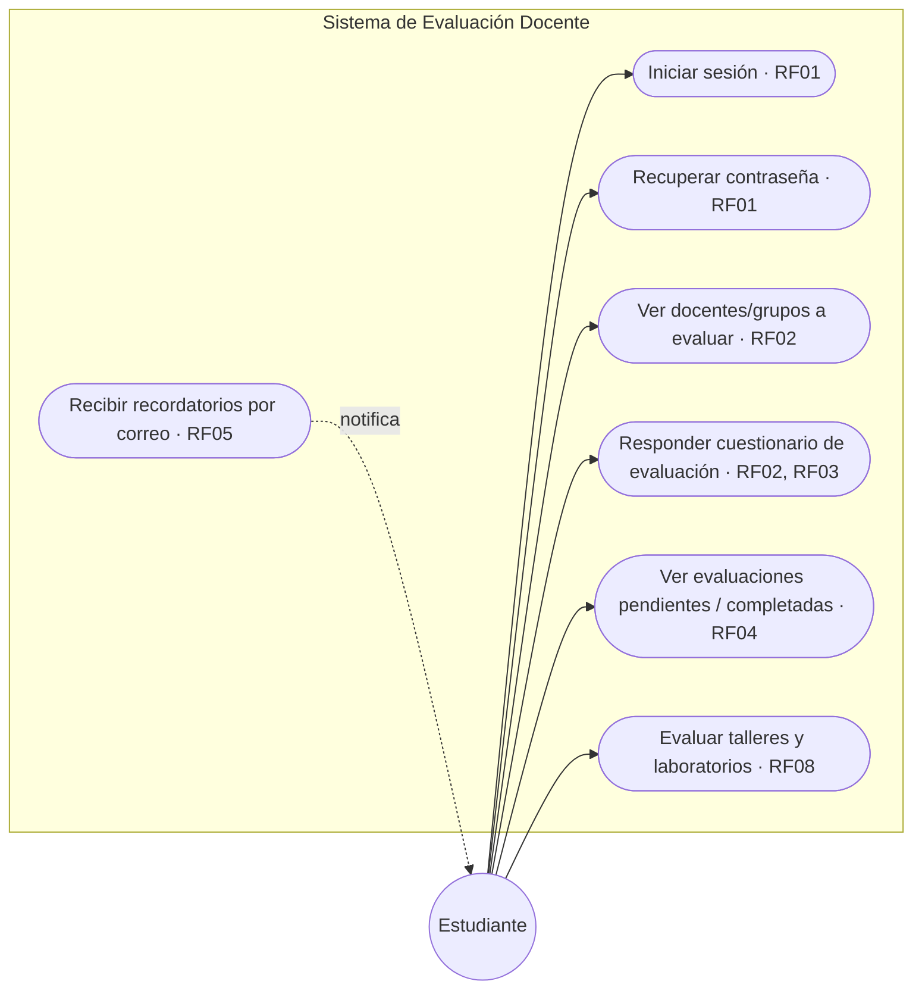
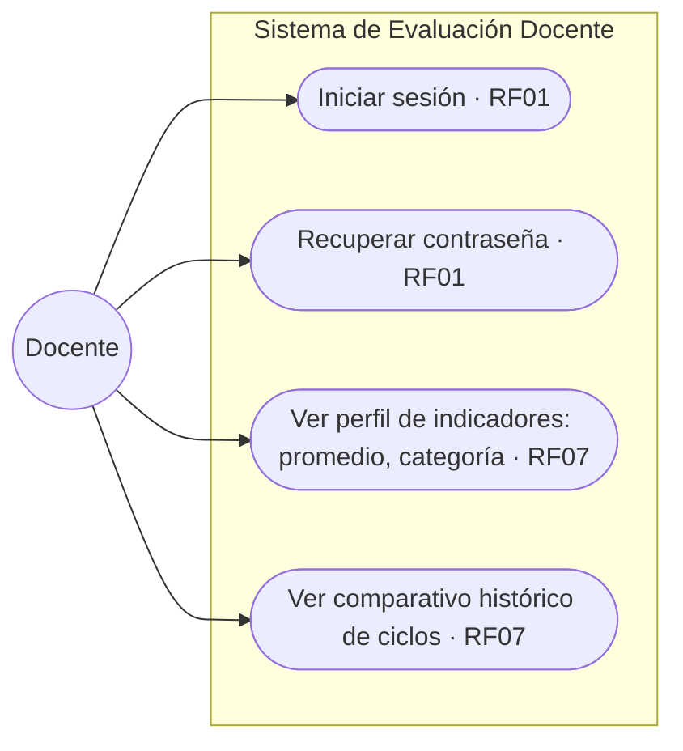
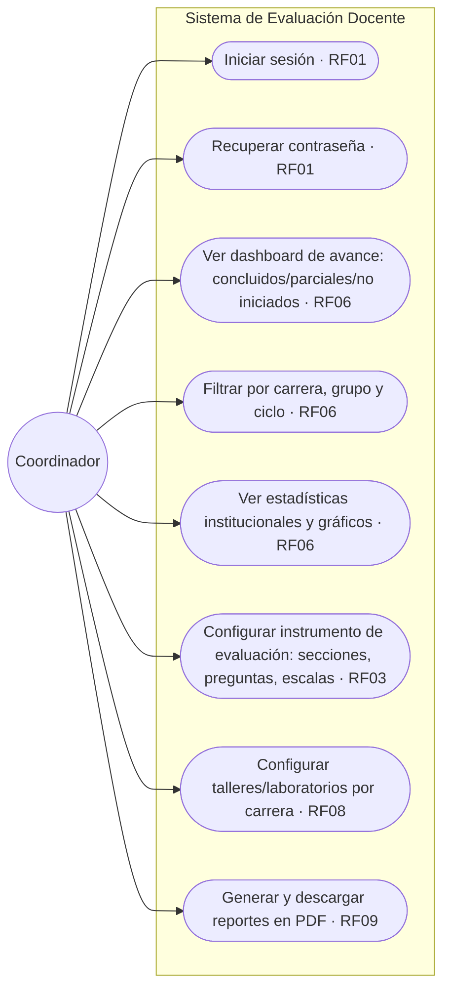
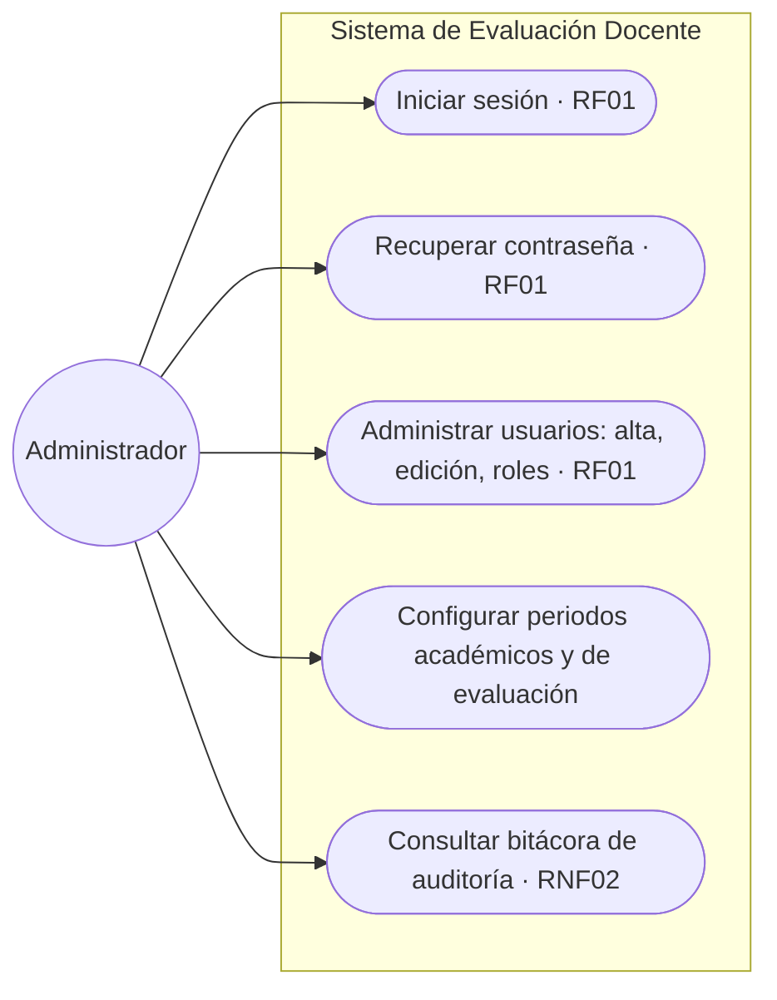
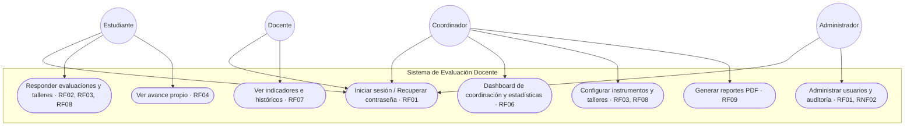

# Diagramas de casos de uso (UML) — 4 roles de usuario

**Proyecto:** Sistema de Información de Evaluación Docente Institucional Adaptable
**Equipo:** Ingenieros Malas Influencias · **Jira:** SCRUM-21

> Diagramas en formato Mermaid (se renderizan nativamente en GitHub). Cada caso de uso está etiquetado con el requerimiento funcional del que proviene — ver `docs/requerimientos.md`.

## Actores del sistema

- **Estudiante** — responde evaluaciones de sus docentes y talleres.
- **Docente** — consulta sus propios resultados e indicadores.
- **Coordinador** — da seguimiento al avance, configura instrumentos y talleres, genera reportes.
- **Administrador** — gestiona usuarios, catálogos y seguridad del sistema.

---

## 1. Estudiante

## 2. Docente

## 3. Coordinador

## 4. Administrador

---

## Vista general (los 4 roles)

